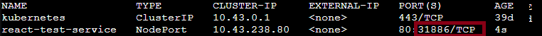

# Déploiement Nginx sur Kubernetes
Ce projet contient un fichier YAML permettant de déployer un serveur Nginx contenant un projet react minimal (basé sur l’image nginx:stable-alpine) dans un cluster Kubernetes.

Le déploiement crée 2 réplicas

📂 Contenu du projet 
Contient la définition du déploiement Kubernetes avec :

<li>2 pods Nginx</li>

<li>La configuration des containers et du port exposé </li>

🚀 Prérequis
Avant d’utiliser ce projet, assure-toi d’avoir :

<li>Un cluster K3s fonctionnel</li>

<li>kubectl installé</li>

📦 Déploiement
Clone ou copie ce projet sur ta machine.

Applique le manifeste Kubernetes avec la commande : 
``` kubectl apply -f react.yaml ``` 

Vérifie que les pods sont bien créés : 
``` kubectl get pods ```

Récupère le port assigné:
``` kubectl get logs ```

[//]: # ()

Accès au service:
``` curl <MASTER_IP>:<PORT> ```

📌 Notes 
Ce déploiement ne crée pas de service exposé à l’extérieur du cluster.
Par défaut Treafik, installé avec k3s, permet d'accéder à nos pods depuis l'ip du master
Donc le nginx est accessible par l'IP du master